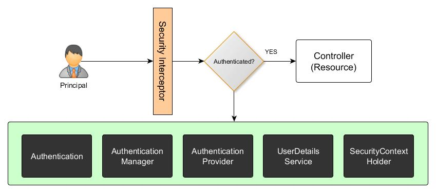

# Spring Security course examples
Spring Security enables you to take care of authentication and authorization of
your application in all aspects.
* It also has top-level projects to deal specifically
with a number of authentication mechanisms, such as LDAP, OAuth, and SAML.
* Spring Security also gives you enough mechanisms to deal with common security attacks,
such as Session Fixation, Clickjacking, and Cross-Site Request Forgery.
* Moreover, it has very good integration with a number of Spring Framework projects,
such as Spring MVC, Spring WebFlux, Spring Data, Spring Integration, and Spring Boot.

# Terminology
* **Principal**: Any user, device, or system (application) that would like to interact with your application.
* **Authentication**: A process by which your application makes sure that the principal is who they claim to be.
* **Credentials**: When a principal tries to interact with your application, the authentication process kicks in and challenges the principal to pass on some values. One such example is a username/password combination and these values are called credentials. The authentication process validates the principal's passed-in credentials against a data store and replies back with the appropriate result.
* **Authorization**: After successful authentication, the principal is checked again for actions that it can perform on your application. This process of checking rights for a principal and then granting necessary permissions is called authorization.
Secured item/resource: The item or resource that is marked as secured and requires the principal (user) to successfully complete both authentication and authorization.
* **GrantedAuthority**: A Spring Security object (org.springframework.security.core.GrantedAuthority interface) that contains/holds permissions/access-right details of a principal.
* **SecurityContext**: A Spring Security object that holds a principal's authentication details.

## Authentication
Process of identifying an individual (principal) using credentials
* Username & password
* Tokens
* Biometrics
* _Person ID_

_Real life_: If you like to cross the border, an official check your passport. Hi/She checks the passport
photo, passport validity, etc. In other words he/she authenticates you as a person.

## Authorization
Process of granting someone access to a resource
* Files
* Records
* Databases
* _Legal rules_

_Real life_: If the country you like to enter requires a visa (access rules), an official let you cross
the border only if you have the visa. If you do not have a visa, you are not authorized to enter the country.

Spring supports:
* **Web URL**: Based on a URL or URL pattern, you can control access
* **Method** invocation: Even a method in a Java Bean can be access-controlled if needs be
* **Domain** instance: Control access to specific  data by having access control of
certain needed domain objects within your application
* **Web service**: Allows you to secure exposed web services in your application

If your serving layer exposes only RESTful endpoints and the data in your application is properly categorized as resources (complying with REST principles), using a Web URL approach can be considered.
If your application just exposes endpoints (REST-based), you can consider using Method invocation based authorization.

## Spring Security concept

* **SecurityContextHolder** - stores details of the present SecurityContext of the application (_getContext()_),
  details of the principal (logged in user) currently using the application (represented by Authentication object).
  Security context is always available to methods in the same thread of execution
* **UserDetailsService** - provides _UserDetails_ interface, which is representation of the principal in user store (SQL, LDAP, …).
  Spring provides common implementations for you
* **AuthenticationProvider** - processes _Authentication_ object. Abstraction for fetching user information from a specific repository.
  Multiple providers can be defined and chained. You can implement your custom _AuthenticationProvider_.
* **AuthenticationManager** - validates given principal (represented by _Authentication_ object). Returns a fully populated
  _Authentication_ instance on successful authentication.
* **Authentication** - represents the token for an authentication request or for an authenticated principal.Once the request
  has been authenticated, the _Authentication_ will usually be stored in a thread-local _SecurityContext_ managed by the
  _SecurityContextHolder_.

### Other

* **AccessDecisionVoter** -Concrete implementation is responsible for voting on authorization decisions.
* **AccessDecisionManager** - Makes a final access control (authorization) decision based on Access decision voters.   
