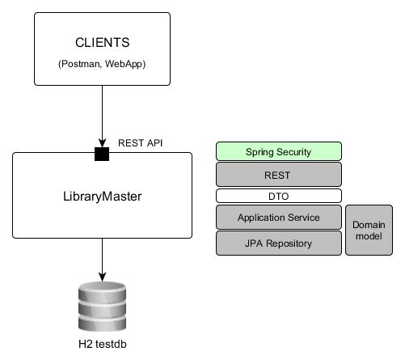

# Example of simple Spring Boot with Security application


## Spring security defaults
The Spring Security protects endpoint by HTTP Basic Authorization. It generates the default user and random password.
Notice the generated password is logged during application start.
```
Using generated security password: <value>
```
You can tune default user/password by _spring.security.user.name_ and _spring.security.user.password_ cfg properties.

## Caching
To cache entities, you can utilize the [JPA](https://jcp.org/aboutJava/communityprocess/final/jsr338/index.html) second level cache. To cache objects on different layers (Controllers, Services), you can utilize the [Spring Caching](https://docs.spring.io/spring-boot/docs/current/reference/html/boot-features-caching.html) feature.

### How to JPA Second level cache
You must include a cache implementation to your project. For instance Hibernate Ehcache.
`compile('org.hibernate:hibernate-ehcache')`. Then you need to enable Second level cache
in Spring Boot property file. Add following to _application.properties_.
```
spring.jpa.properties.hibernate.cache.use_second_level_cache=true
spring.jpa.properties.hibernate.cache.use_query_cache=true
spring.jpa.properties.hibernate.cache.region.factory_class=org.hibernate.cache.ehcache.EhCacheRegionFactory
spring.jpa.properties.javax.persistence.sharedCache.mode=ENABLE_SELECTIVE
```
As the caching mode in above example is ENABLE_SELECTIVE, you must annotate
each Entity which should be cached by _javax.persistence.Cacheable_ annotation.

```
@Cacheable
public class Book{}
```  
Now the Book entities are cached.

### How to Spring caching
The Spring cache components auto-configuration is enabled by including Boot starter
Cache `compile('org.springframework.boot:spring-boot-starter-cache')` as dependency,
and @EnableCaching annotation on configuration class.
Then you can use declarative (Annotations) or programmatic (via CacheManager API) Caching in
your application. Use `org.springframework.cache.annotation.Cacheable` on Service
method to cache returned values. Check `org.springframework.cache.annotation` for
all available annotations. The API approach is based on _CacheManager_ interface.
You can autowire a CaheManager into your Spring component.
```
@Autowired
CacheManager cacheManager;
```

## Testing
Check the _MyTest_ class, how to provide specific test Context for your test.
* to bulid-up complete Spring test context use _@Configuration/@ContextConfiguration_
* to extend primary Spring Boot application context use _@TestConfiguration/@Import_
