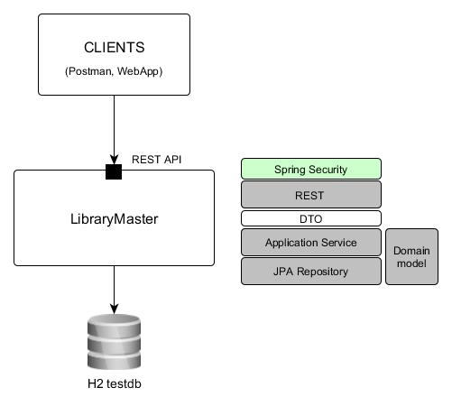

# Example of simple Spring Boot with Security application 


## Spring security defaults
The Spring Security protects endpoint by HTTP Basic Authorization. It generates the default user and random password.
Notice the generated password is logged during application start.
```
Using generated security password: <value>
``` 
You can tune default user/password by _spring.security.user.name_ and _spring.security.user.password_ cfg properties.

----
* https://docs.spring.io/autorepo/docs/spring-security/5.0.x/reference/html/ldap.html

## LDAP Concepts
* **LDAP** - is a software network protocol that will provide options for Internet applications to identify organizations, 
usernames, passwords, and other resources by searching based on the key and value pair.
* **X.500** - is a standard for directory services that holds a small amount of data that is to be used in a network and 
this standard is the basic for Directory Access Protocol (DAP). The LDAP directory structure follows a simple tree structure 
that contains information about organizations, usernames, password, and so on. Directories will contain a descriptive, 
attribute-based information and support sophisticated filtering capabilities.

* **dc** - Domain component: Generally, the highest level of organization in an LDAP hierarchy.
* **c**  - Country: Some LDAP hierarchies are structured at a high level by country.
* **o**  - Organization name: It is a parent business organization used for classifying LDAP resources.
* **ou** - Organizational unit: It is a divisional business organization which is generally within an organization.
* **cn** - Common name: This is a common name, or a unique or human-readable name for the object. For humans, this is usually the person's full name, while for other resources in LDAP (computers, and so on), it's typically the hostname.
* **uid** - User ID: Although not organizational in nature, the uid attribute is generally what Spring looks for during user authentication and search.
* **userPassword** - User password: This attribute stores the password for the person object to which this attribute is associated. It is typically one-way hashed using SHA or something similar.


## Spring Security concept
* **Authentication** - representation of the current user authentication
* **UsernamePasswordAuthenticationToken** - one of the implementation of the Authentication interface
* **AuthenticationManager** - process authentication request
* **GrantedAuthority** - access control to app resources, user roles (role based authorization)
* **SecurityContextHolder** - provides access to SecurityContext which is stored in the ThreadLocal
* **SecurityContext** -  Principal, UserDetails


