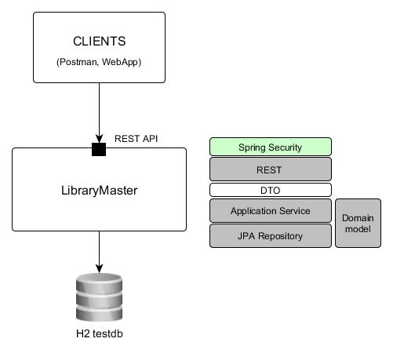
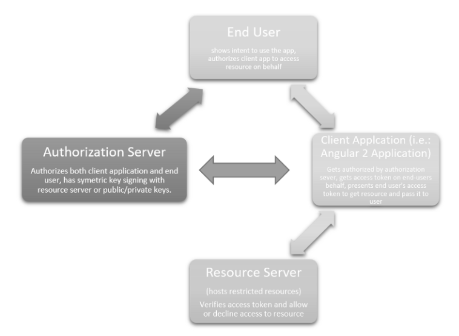

# Example of simple Spring Boot with Security application 

## JWT
[JSON Web Tokens](https://jwt.io/) are an open, industry standard RFC 7519 method for representing claims securely between two parties.

Authentication
* User authenticates at the Authorization server with credentials from an Application (User agent)
* The Authorization server issues signed JWT token with defined claims (grants, roles)
* An Application stores JWT token and uses it for accessing Resources provided by the Resource server

Authorization
* An Application wants to access a Resource provided by the Resource server
* The JWT token obtained during Authentication is send along with request by an Application (_Authorization_ HTTP header)
* The Resource server validates JWT token in several steps (format, signature verification, ...)
* The claims included in JWT token are used to authorize access to Resource    

## Spring security configuration

This example demonstrates simple usage of the JWT. It utilizes Spring Security Filters. There are two filters used:
* JWTAuthenticationFilter - checks user's credentials and issues JWT token (Authorization server role). As it extends the
  _UsernamePasswordAuthenticationFilter_ it automatically registers for _/login_ endpoint.
* JWTAuthorizationFilter - as it extends the _BasicAuthenticationFilter_, Spring security replaces default filter in filter 
  chain by this custom implementation. 
 

## OAuth2 concept

